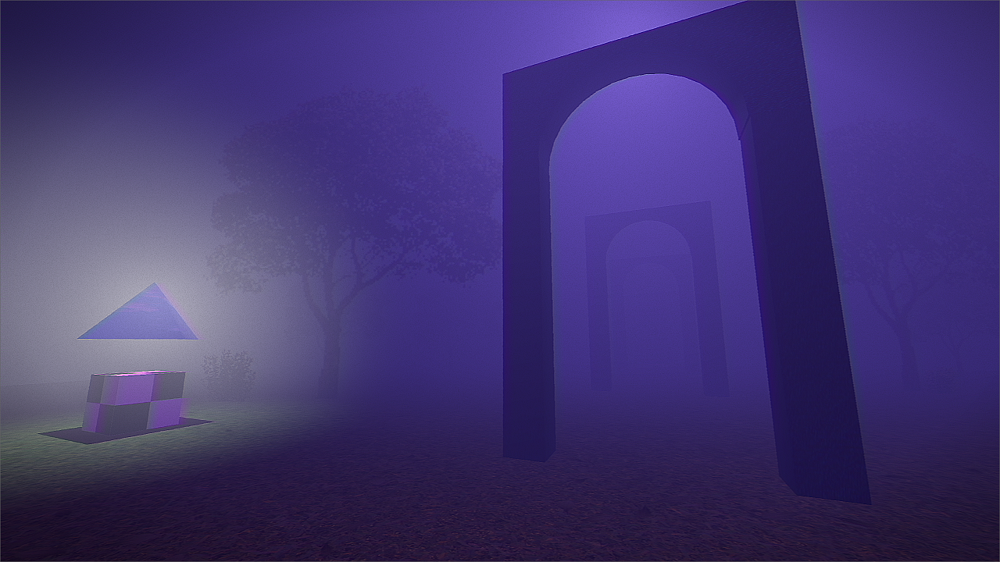

# OTHERDOMAIN

## Overview
You wake up in an unfamiliar place- alone. 
It's some sort of lobby area, with a central garden and walls lined with doors.
It's relatively peaceful, all things considered... but where are you? and how did you get here?
Have you always been here, or are you waking up for the first time?
The only clue you have is some text sprawled out on the wall in front of you:

> *OTHERDOMAIN:*
> *Players Online: 1*

Your attention shifts to the wall of doors adjacent to you, and without much thought, you choose to enter one. Suddenly, witness your soul exiting your body, and for a brief moment, there is nothing but darkness and silence. When you come to, you find yourself in an entirely new location altogether.
It's quite dark and foggy, however the door you entered from is now locked...
There's no going back now.
Now, it's up to you to figure out what's going on, and uncover the mysteries of OTHERDOMAIN.

***
## General Information
OTHERDOMAIN is a surreal, dream-like, exploration game centered around navigating strange, nonsensical landscapes, meeting curious creatures, gathering clues, and solving puzzles. The game makes use of a first-person perspective, 3d environments, and . Various featured (or planned) gameplay mechanics include:

	- Item management system
	- Non-linear dialogue
	- Mini-games
	- Puzzle system

***
## SCREENSHOTS

